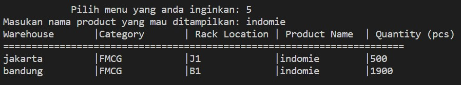
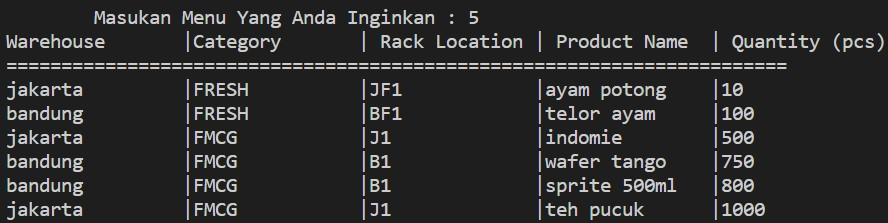

# Warehouse Inventory System with Python
## Purwadhika Job Connector Data Science Capstone Project Module 1
### By: Revalde Raditya Candra

After two weeks of learning Python on ***JC Data Science Program at Purwadhika***, we must do a capstone project every time we finished the module exam in this capstone project we must do a **CRUD** function (**C**reate, **R**ead, **U**pdate, and **D**elete).

For this capstone project of mine, I decided to take Warehouse Dataset. At this dataset, the warehouse's location will be divided into two different warehouses **Jakarta** and **Bandung** Warehouse, besides that at those two warehouses the goods stored are **FMCG** and **FRESH** products FMCG products are daily goods such as instant noodle, packed tea, snacks; and FRESH product are products that cannot sustain for a long time such as chicken fillet and egg.

Below is the function that is available in my Python code:

1. At the starting menu it will give few choices to choose from, the options are:
  - Show the available stock
  - Add items
  - Delete items
  - Take out items
  - Restock items
  - Sort the lowest stock
  - Exit the program 
  .jpg)
 
2. In menu number 1 (Show the available stock) there will be other options that must be chosen:
  - Show all available stock
  - Show all stocks at a certain ***warehouse*** location
  - Show all stocks for chosen ***category***
  - Show all stocks according to their ***racking location***
  - Show all stocks according to their ***product name***
  - Return to the main menu
  - Exit the program 
    .jpg)
 
3. If the number that was chosen was number 1 then it will show all the available stocks in the inventory.
 
   .jpg)
 
4. If the number that was chosen was 2 then it will show only the stocks that are located in the specific area that was inputted.
  - In the example below the warehouse that was chosen to show is warehouse Bandung

    .jpg)

5. For the third option in the first menu it will show the stock according to their category (**FMCG/FRESH**).
  - In the example below the number that was chosen was number 1 therefore it will resulting show the **FMCG** items only

    .jpg)
    
6. The fourth option is a function to show all the stocks that racked in the specific **rack location**.
  - In the example below, the designated location is the rack located in Jakarta Warehouse therefore the rack location is ***j1***, however, if the user wants to call the **FRESH** product in Jakarta warehouse the rack location is ***jf1***.
    .jpg)
    
7. The fifth option is a function to show a specific **product name** that was input before.
  - In the example below, after the adding *indomie* in Bandung warehouse, the selected **product name** is *indomie*
   

8. For the second menu, there will be a few choices such as:
  - Adding new inventory stock
  - Updating the existing stock
  
    .jpg)
 
9. If the menu that was selected is menu number 1, then it will make the program add another item to the inventory system by filling out the question that was asked, and after the command was done, the data will automatically be saved. However, it only can be done if the keys that were inputted are not the same as the keys that already existed before.
  - In the screenshot below it showed that the user want to add an **indomie** item at **Bandung Warehouse**, therefore the keys that were inputted ***indomiebdg***. 
     .jpg)

  - After the *input* of the question is done, it will automatically be saved into the **database**, and it will result like the screenshot below.
     .jpg)

10. If the menu that was selected is menu number 2, then it will make the program update items in the inventory system by filling out the question that was asked, and after the command was done, the updated data will automatically be saved. However, it only can be done if the keys that were inputted are the same as the keys that want to be updated. And if the menu selected was 3 it will make the program go back into the main menu, if the menu that was selected was 4 then it will close the program.
  - In the example below, the item that wants to be updated is the **Indomie** item at the **Jakarta** warehouse, therefore the keys that must be input is indomiejkt and from there the user can choose what they want to update, the example the data that want to be updated is the *Quantity (pcs)*. If the keys that were inputted were not registered in the *database* it will result in an error and it will back to the main menu.
    .jpg)

  - And after all the input was inputted it will automatically be saved into the main stock.
    .jpg)

11. Menu 3 is a command to delete an item based on their keys.

    .jpg)
  - After the selected keys are submitted it will cause the keys to be gone or deleted. In this example the designated keys were **Indomie** items from **Jakarta warehouse**, therefore the written keys are ***indomiejkt***
   .jpg)

12. In menu 4 the user can release an item that they want and it will automatically count in the main inventory
  - In the example below, after menu 4 was chosen the program will ask which keys they want to release, after writing ***indomiejkt*** as the keys that want to be released, it will continue asking how many pieces they want to be released. 
    .jpg)
    
  - It can be seen in these two screenshots that the number of **Indomie** items in the **Jakarta** warehouse at first was 500 pieces after menu 4 was done the number of **Indomie** items in **Jakarta** warehouse decreased to 410 pieces
     .jpg)
     .jpg)
     
13. On menu 5 the user can do a restock for the inventory by selecting the desired items keys and input the desired number of items quantity that want to be add into the available stock.
  - In the example below, after menu 5 was chosen the program will ask which keys that the user want to increase the stock, after writing ***indomiejkt*** as the desired keys, it will continue asking how many item that want to be added. 
     
  - It can be seen in these two screenshots that the number of **Indomie** items in the **Jakarta** warehouse at first was 500 pieces after menu 5 was done the number of **Indomie** items in **Jakarta** warehouse increased to 510 pieces
     .jpg)
     .jpg)

14. Menu 6 is a function that can make the user sort their lowest stock until the highest.
     
     
15. The last menu is to close the program. 
     .jpg)
     

And that's all that for my Capstone Project for Python Programming, thank you for sparing your time to read my Capstone project. 
Massive kudos to Kak Achmad that has been guided me through my Python learning process and this Capstone project. 
This coding file and readme file are all presented by Revalde Raditya Candra. 
Let's e-connect through LinkedIn at [Revalde Raditya Candra](https://www.linkedin.com/in/revalde/)
