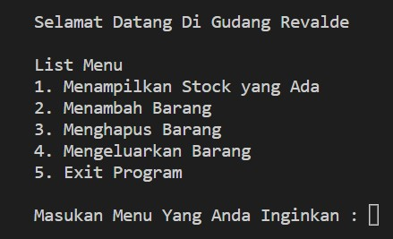
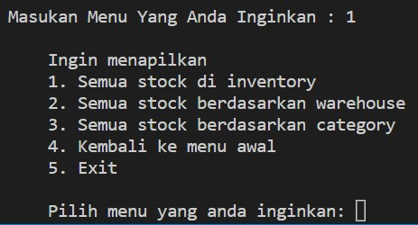
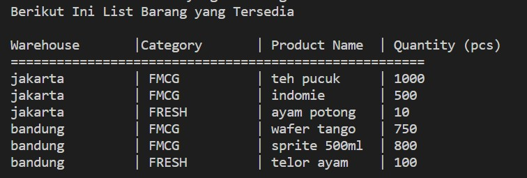
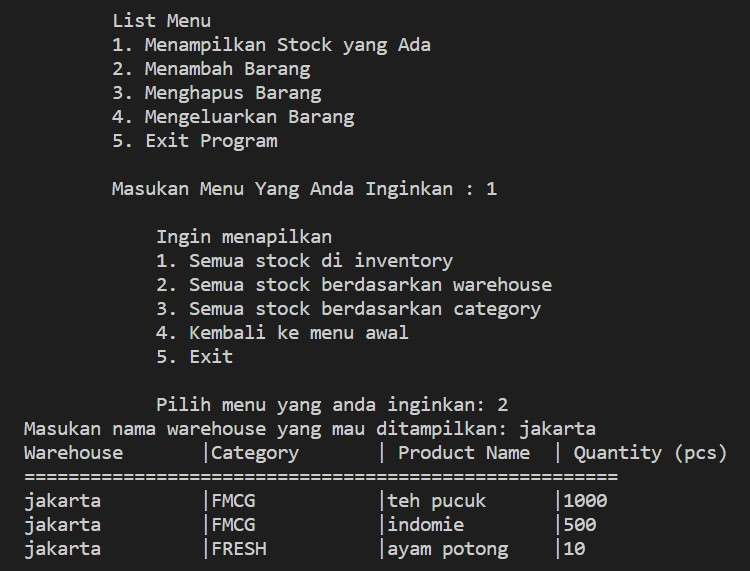
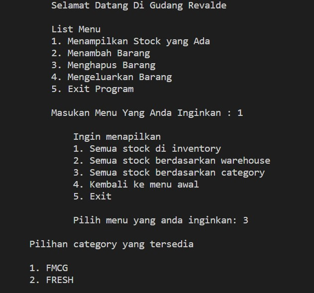
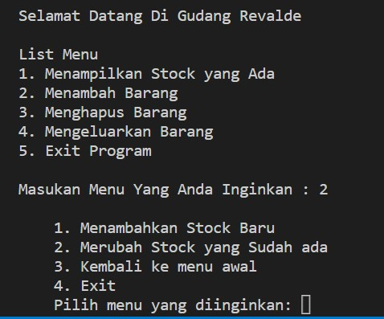
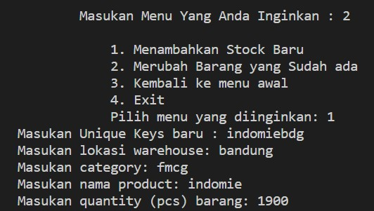
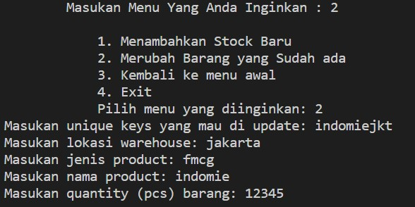
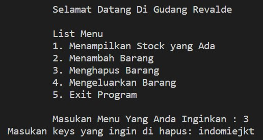

# Warehouse Management System with Python
## Purwadhika Job Connector Data Science Capstone Project Module 1
### By: Revalde Raditya Candra

After two weeks of learning Python on ***JC Data Science Program at Purwadhika***, we must do a capstone project everytime we finished the module exam in this capstone project we must do a **CRUD** function (**C**reate, **R**ead, **U**pdate, and **D**elete).

At this capstone project of mine I decided to take Warehouse Dataset. At this dataset, the warehouse's location will be divided into two different warehouses **Jakarta** and **Bandung** Warehouse, beside that at those two warehouses the goods that will be storing are **FMCG** and **FRESH** products FMCG product are basically daily goods such as instant noodle, packed tea, snacks; and FRESH product are products that cannot sustain for long time such as chicken fillet and egg.

Below are the function that available in my python code:

1. At the starting menu it will give few choices to choose, the options are:
  - Show the available stock
  - Add items
  - Delete items
  - Take out items
  - Exit the program
  
 
 
2. In the menu number 1 (Show the available stock) there will be another options that must be choose:
  - Show all available stock
  - Show all stocks at certain warehouse
  - Show all stocks for chosen category
  - Return to main menu
  - Exit the program
  
 
 
3. If the number that was chosen was number 1 than it will show all the available stocks at the inventory
 
 
 
4. If the number that was chosen was 2 than it will show only the stocks that are located in the specific area that was inputted

5. For the last option in the first menu it will show the stock according to their category (FMCG/FRESH)

.jpg)

6. For the second menu, there will be few choices such as:
  - Updating the available stock
  - Updating the
  
 
 
7. If the menu that was selected is menu number 1, then it will make the program to add another items into inventory system by filling out the question that was asked, and after the command was done, the data will automatically saved. However, it only can be done if the keys that was inputted not the same with the keys that already existed before.
  - In the screenshot below it showed that the user want to add indomie item at Bandung warehouse, therefore the keys that was inputted indomiebdg.

  - After, the *input* of the question was done, it will automatically saved into the ***database***, and it will resulted like the screenshot below.
.jpg)

8. If the menu that was selected is menu number 2, then it will make the program to update an items in the inventory system by filling out the question that was asked, and after the command was done, the updated data will automatically saved. However, it only can be done if the keys that was inputted is the same with the keys that want to be updated. And if the menu was selected was 3 it will make the program to back into main menu, if the menu that was selected was 4 than it will close the program.
  - In the example below, the item that want to be updated is **Indomie** item at **Jakarta** warehouse, therefore the keys that must input is indomiejkt and from there the user can choose what they want to update, in the example the thing that want to be update is the *Quantity (pcs)*. If the keys that was inputted was not registered in the *database* it will resulting an error and it will back to main menu.  

  - And after all the input was inputted it will automatically saved into main stock.
.jpg)

9. Menu 3 is just simply delete an item based on their keys.

  - After the selected keys was submitted it will causing the keys to be gone or deleted. In this example the designated keys was **Indomie** items from **Jakarta warehouse**, therefore the written keys is ***indomiejkt***
  
 .jpg)
